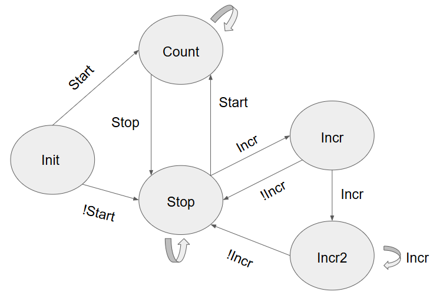

# FPGA Stopwatch

In order to familiarize myself with fundamental digital logic concepts, I have created a stopwatch using the FPGA inside a [Real Digital Blackboard](https://www.realdigital.org/hardware/blackboard).

## FSM

## Block Diagrams

### Stopwatch
